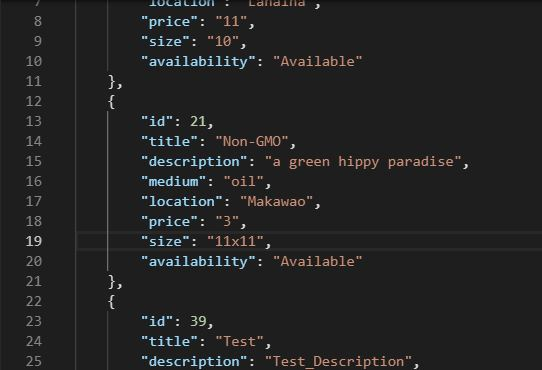
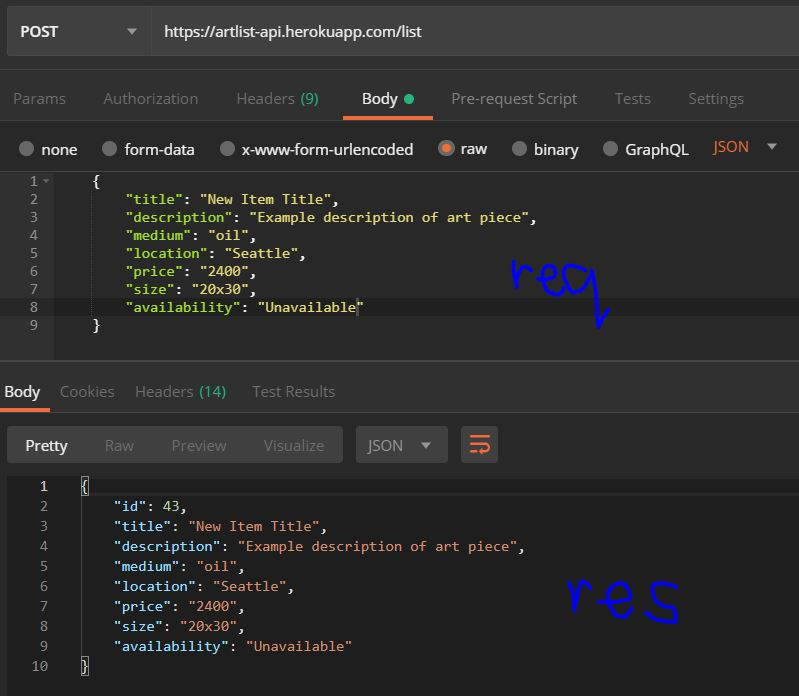
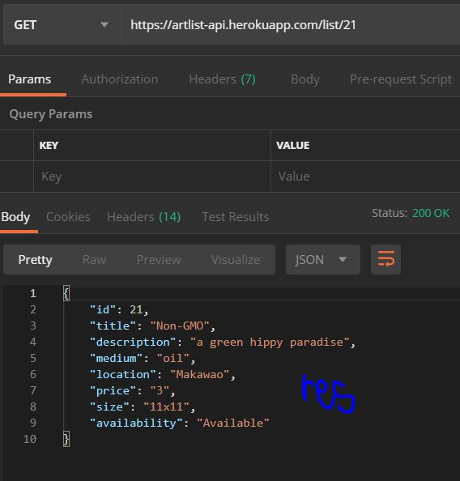
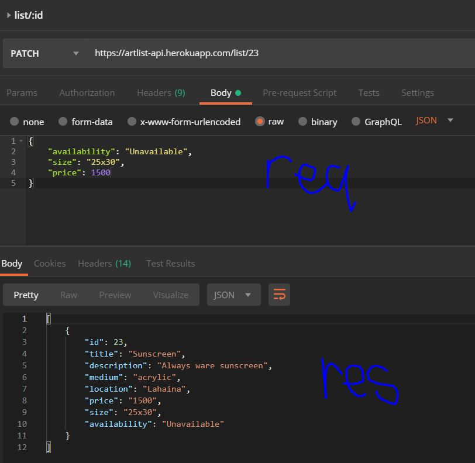
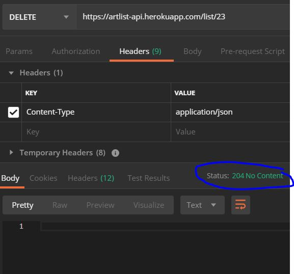

# Artlist API

The Artlist API is a RESTful API that uses 5 endpoints to serve basic CRUD opperations for the Artlist Client App (link below)
It stores data in a Heroku hosted PostgreSQL database called ["artlist-api"](https://artlist-api.herokuapp.com/)

## Live API and Client links

- [Click Here](https://artlist-api.herokuapp.com/) to interact with the _live API_
- [Click Here](https://artlist-app.now.sh/) to view the _live Client_ in the browser.

## GitHub repo links

- [Click Here](https://github.com/mr-dojo/artlist-api) for the _API_ repo
- [Click Here](https://github.com/mr-dojo/artlist-app) for the _Client_ repo

## Endpoints

1. ### "GET /list"
   returns an array of JSON objects representing items in the "list" table
   
2. ### "POST /list"
   adds a new item to the "list" table
   list items have the following columns:
   - id = (created by default)
   - title = (_required_ string)
   - description = (string)
   - medium = (string)
   - location = (string)
   - price = (integer _no decimals_)
   - size = (string)
   - availability = (enum of either "Available", "Unavailable" or "Complicated")
     
3. ### "GET /list/:item-id"
   returns an item with the id that matches item-id
   
4. ### "PATCH /list/:item-id"
   edits an item with the id that matches item-id (requires one of the following values: title, description, medium, location, price, size, availability)
   
5. ### "DELETE /list/:item-id"
   deletes an item with the id that matches item-id
   

## Scripts

- Start the application `npm start`
- Start nodemon for the application `npm run dev`
- Run the tests `npm test`
- Migrate `npm run migrate`
- Migrate Test `npm run migrate:test`

Seeding databases

- Seed artlist `psql -U dunder_mifflin -d artlist -f ./seeds/seed.artlist.sql`
- Seed artlist-test `psql -U dunder_mifflin -d artlist-test -f ./seeds/seed.artlist.sql`

## Deploying

Add a new Heroku application with `heroku create`. This will make a new git remote called "heroku" and you can then `npm run deploy` which will push to this remote's master branch.

## Technology used

The RESTful API is hosted on Heroku and was written in Javascript ES6 using Node.js with Express as a framework.
I used Mocha and Chai to test.
The database uses PostgreSQL and is also hosted on Heroku.

The client side app hosted on Zeit and is written in:

- HTML5
- CSS3
- Javascript ES6
- JSX.
  I used React as a framework and Jest for testing.
